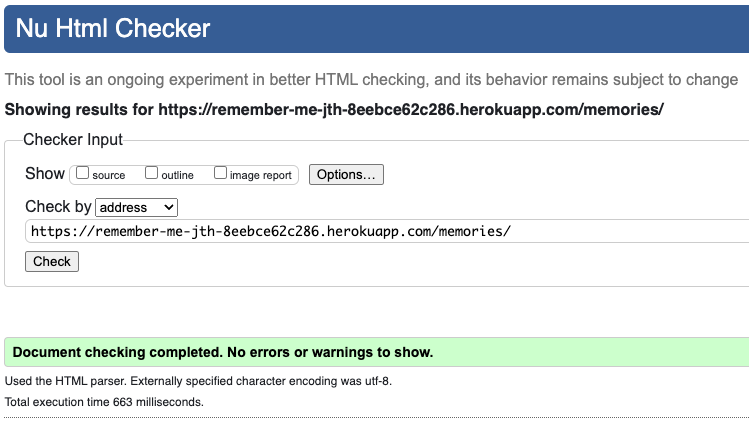
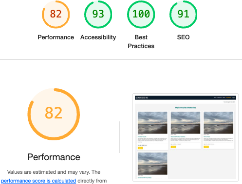

# TESTING DOCUMENTATION
## REMEMEBER-ME Django Project

### Content

1. [Validation](#validation)  
    - [HTML](#html-validation)  
    - [CSS](#css-validation)  
    - [Python](#python-validation)  
2. [Lighthouse](#lighthouse)  
3. [Automated Testing](#automated-testing)  
4. [Browsers and Device Testing](#browsers-and-device-testing)
5. [Manual Testing](#manual-testing)  
    - [Feature Testing](#feature-testing)  
6. [Bugs](#bugs)

---

## 1. Validation <a name="validation"></a>

### HTML Validation <a name="html-validation"></a>
The HTML code was validated using the [W3C Validator](https://validator.w3.org/). This ensures that the HTML structure adheres to modern standards, free from syntax errors and compatibility issues.

**Home** (home.html)


**Memories** (memories.html)



**Post Details** (post_detail.html)


**About** (about.html)


**Favourites** (favourites_list.html)


**Login** (login.html)


**Sign up** (signup.html)


**Logout** (logout.html)


**Edit Post** (edit_post.html)


**Delete Post** (delete_post.html)


**Edit Comment** (edit_comment.html)


**Delete Comment** (delete_comment.html)


### CSS Validation <a name="css-validation"></a>
The CSS was validated using the [W3C CSS Validator](https://jigsaw.w3.org/css-validator/). This process ensures proper styling practices and compatibility across browsers.

**Home** (home.css)


**Memories** (memories.css)


**Post Details** (post_detail.css)


**About** (about.css)


**Favourites** (favourites_list.css)


**Login** (login.css)


**Sign up** (signup.css)


**Logout** (logout.css)


**Edit Post** (edit_post.css)


**Delete Post** (delete_post.css)


**Edit Comment** (edit_comment.css)


**Delete Comment** (delete_comment.css)


### Python Validation <a name="python-validation"></a>
The Python code was checked for errors using [Code Institute's Python Linter](https://pep8ci.herokuapp.com/) to ensure it follows PEP 8 standards and is free from major syntax issues or inefficiencies.

**manage.py**


**models.py**


**views.py**


**urls.py**


**forms.py**


### JavaScript Validation <a name="js-validation"></a>
Code has been validated with the official [Jshint](https://jshint.com/) validator and returned no errors or warnings.

**script.js**


---

## 2. Lighthouse <a name="lighthouse"></a>
[Lighthouse](https://developers.google.com/web/tools/lighthouse/) audits were performed to evaluate the website’s performance, accessibility, best practices, and SEO. Each metric was reviewed, and adjustments were made to improve the scores where necessary.

**Home** 


**Memories**


**Post Details** 


**About** 


**Favourites**



---
## 3. Automated Testing <a name="automated-testing"></a>

Automated testing played a crucial role in verifying the functionality and reliability of the application. Using the powerful [pytest](https://docs.pytest.org/) framework, I ensured that key features performed seamlessly across various scenarios.

The tests primarily focused on validating views and forms, rigorously assessing their behavior under diverse conditions. Running the tests is straightforward—simply execute the following command in the terminal:

```bash
python3 manage.py test
```

Upon completion, the tests returned no errors, confirming the robustness of the application.


---


## 4. Browsers and Device Testing <a name="browsers-and-device-testing"></a>

#### Supported Browsers and Devices
My web application has been thoroughly tested to ensure compatibility and responsiveness on the following browsers and devices:

#### Browsers
Extensive testing was performed on all major web browsers to confirm compatibility and consistent performance. The tested browsers included:  
- [Google Chrome](https://www.google.com/chrome/) (latest version)  
- [Mozilla Firefox](https://www.mozilla.org/firefox/) (latest version)  
- [Safari](https://www.apple.com/safari/) (latest version)  

#### Responsiveness Testing
Responsiveness was verified through a combination of manual testing using Chrome Developer Tools, ResponsivelyApp, and live testing on physical devices. This ensures a seamless user experience across different screen sizes and orientations.

### Test Results

#### Browser Performance

| **Device/Screen Size**  | **Chrome Performance** | **Safari Performance** |
|--------------------------|------------------------|-------------------------|
| Desktop (2560x1440)      | No issues             | No issues              |
| Laptop (1366x768)        | No issues             | No issues              |
| Tablet (iPad)            | No issues             | No issues              |
| Mobile (iPhone 12 Pro)   | No issues             | No issues              |

---

#### Device Testing

The application was rigorously tested on a wide range of devices to ensure optimal performance. Below is a summary of the testing results:

| **Device**          | **Resolution** | **Render** | **Layout** | **Functionality** | **Links** | **Images** | **Portrait/Landscape** |
|----------------------|----------------|------------|------------|--------------------|-----------|------------|-------------------------|
| iPhone 12 Pro      | 390x844        | Pass       | Pass       | Pass               | Pass      | Pass       | Pass                   |
| iPhone 14 Pro Max  | 414x896        | Pass       | Pass       | Pass               | Pass      | Pass       | Pass                   |
| iPad               | 768x1024       | Pass       | Pass       | Pass               | Pass      | Pass       | Pass                   |
| MacBook Air M3     | 1440x900       | Pass       | Pass       | Pass               | Pass      | Pass       | Pass                   |
| Dell Desktop       | 2560x1440       | Pass       | Pass       | Pass               | Pass      | Pass       | Pass                   |

---


## 5. Manual Testing <a name="manual-testing"></a>

### Feature Testing <a name="feature-testing"></a>
Each feature of the application was manually tested to ensure it behaves as expected. This included user interactions such as:  

### Navigation Bar

| **Feature**              | **Expected Outcome**                                                                                  | **Testing Performed**                                     | **Result**                                      | **Pass/Fail** |
|---------------------------|------------------------------------------------------------------------------------------------------|----------------------------------------------------------|------------------------------------------------|---------------|
| **Navbar Display**        | Navbar is displayed with brand name and navigation links on desktop and mobile.                      | Load website in desktop and mobile views.                | Navbar is correctly displayed.                 | Pass ✅       |
| **Brand Link**            | Clicking the "Remember Me" brand redirects the user to the homepage.                                 | Click on the navbar brand logo.                          | User is redirected to the homepage.            | Pass ✅       |
| **Home Link**             | Clicking the "Home" link redirects the user to the homepage.                                         | Click "Home" link.                                       | User is redirected to the homepage.            | Pass ✅       |
| **Memories Link**         | Clicking the "Memories" link redirects the user to the Memories page.                                | Click "Memories" link.                                   | User is redirected to the Memories page.       | Pass ✅       |
| **About Link**            | Clicking the "About" link redirects the user to the About page.                                      | Click "About" link.                                      | User is redirected to the About page.          | Pass ✅       |
| **Active State Styling**  | Current page is visually highlighted with an active state in the navbar.                             | Navigate to each page and check for the "active" class.  | Active state is applied correctly.             | Pass ✅       |
| **Authenticated State**   | Authenticated users see "Favourites" and "Logout" links.                                             | Log in as an authenticated user.                         | Links are correctly shown.                     | Pass ✅       |
| **Unauthenticated State** | Unauthenticated users see "Login" and "Sign Up" links with a divider.                                | Log out and view the navbar.                             | Links and divider are correctly displayed.     | Pass ✅       |
| **Logout Functionality**  | Clicking the "Logout" link logs the user out and redirects to the login page or home.                | Click "Logout" link.                                     | User is successfully logged out.               | Pass ✅       |
| **Mobile Toggler**        | Navbar collapses into a toggle menu on smaller screens, and links expand on toggling the menu.       | Test the navbar on mobile view, click toggler.           | Navbar collapses and expands as expected.      | Pass ✅       |
| **Responsive Behavior**   | Navbar layout adjusts seamlessly between desktop and mobile views.                                   | Resize browser to various screen sizes.                  | Navbar is responsive across all screen sizes.  | Pass ✅       |
| **Sign Up Link**          | Clicking "Sign Up" redirects the user to the signup page.                                            | Click "Sign Up" link.                                    | User is redirected to the signup page.         | Pass ✅       |
| **Login Link**            | Clicking "Login" redirects the user to the login page.                                               | Click "Login" link.                                      | User is redirected to the login page.          | Pass ✅       |
| **Divider Styling**       | Divider between "Login" and "Sign Up" links is properly displayed for unauthenticated users.         | View navbar as an unauthenticated user.                  | Divider is correctly displayed.                | Pass ✅       |

### Home

#### Home: Introductory Section

| **Feature**              | **Expected Outcome**                                                                                          | **Testing Performed**                                     | **Result**                                      | **Pass/Fail** |
|---------------------------|--------------------------------------------------------------------------------------------------------------|----------------------------------------------------------|------------------------------------------------|---------------|
| **Background Image**      | The section displays a background image that covers the entire area and is positioned centrally.             | Load the page and observe the introductory section.       | Background image displays correctly.           | Pass ✅       |
| **Overlay Styling**       | A semi-transparent dark overlay covers the background, improving text readability.                          | Load the page and observe the overlay.                   | Overlay appears with the correct opacity.      | Pass ✅       |
| **Introductory Text**     | The introductory message is centered vertically and horizontally, with proper styling.                       | Load the page and verify the text alignment.             | Text is centered and styled as expected.       | Pass ✅       |
| **Responsive Design**     | The section adjusts its size and maintains alignment on various screen sizes.                                | Resize browser window to test responsiveness.            | Section is responsive and maintains layout.    | Pass ✅       |
| **Text Color**            | The text color contrasts well against the overlay and is easily readable.                                    | Load the page and observe text readability.              | Text is clearly visible.                       | Pass ✅       |
| **Font Style and Size**   | The paragraph text is displayed in an italic font with a font size of 1.5rem and proper line spacing.         | Inspect the text styling in the browser.                 | Font style, size, and spacing are correct.     | Pass ✅       |
| **Z-Index Priority**      | The introductory text is above the overlay and background image, maintaining visibility.                     | Inspect the stacking order of elements using DevTools.   | Text is displayed above the overlay correctly. | Pass ✅       |


#### Home: Recent Memories Section

| **Feature**              | **Expected Outcome**                                                                 | **Testing Performed**                        | **Result**                                      | **Pass/Fail** |
|---------------------------|---------------------------------------------------------------------------------------|---------------------------------------------|------------------------------------------------|---------------|
| **Section Heading**       | Displays "Recent Memories" heading prominently.                                       | Load the page and observe the heading.      | Heading is correctly displayed.                | Pass ✅       |
| **View All Link**         | Clicking "View All Memories" redirects to the Memories page.                          | Click the "View All Memories" link.         | User is redirected to the Memories page.       | Pass ✅       |
| **Recent Posts Display**  | Displays up to three recent posts with their title, excerpt, image, and date.         | Load the page and observe the posts.        | Recent posts are displayed correctly.          | Pass ✅       |
| **Placeholder Image**     | Placeholder image appears when a post has no associated image.                        | Test with a post lacking an image.          | Placeholder image is correctly displayed.      | Pass ✅       |
| **Post Title Link**       | Clicking a post title redirects the user to the post's detail page.                   | Click on a post title link.                 | User is redirected to the post detail page.    | Pass ✅       |
| **Responsive Layout**     | The grid layout adjusts seamlessly across various screen sizes (desktop, tablet, mobile). | Resize browser and test on multiple devices.| Section layout is responsive.                 | Pass ✅       |
| **Card Excerpt and Date** | Post excerpt and creation date are displayed below the title.                          | Inspect each post card.                     | Excerpt and date are correctly displayed.      | Pass ✅       |

#### Home: Login/Sign Up Section

| **Feature**                   | **Expected Outcome**                                                               | **Testing Performed**                        | **Result**                                      | **Pass/Fail** |
|--------------------------------|------------------------------------------------------------------------------------|---------------------------------------------|------------------------------------------------|---------------|
| **Authentication Check**       | Displays different messages and buttons based on the user's authentication status. | Log in and log out to test behavior.        | Correct messages and buttons are displayed.    | Pass ✅       |
| **Message for Authenticated Users** | Displays a message encouraging users to share a memory and provides a "Share Memory" button. | Log in and observe the section.            | Message and button appear as expected.         | Pass ✅       |
| **Message for Guests**         | Displays a message prompting users to sign up and provides a "Sign Up" button.     | Log out and observe the section.            | Message and button appear as expected.         | Pass ✅       |
| **Share Memory Button**        | Redirects authenticated users to the "Create Post" page when clicked.              | Log in and click the button.                | User is redirected to the Create Post page.    | Pass ✅       |
| **Sign Up Button**             | Redirects unauthenticated users to the sign-up page when clicked.                  | Log out and click the button.               | User is redirected to the Sign-Up page.        | Pass ✅       |
| **Centered Layout**            | Section content is horizontally centered on all screen sizes.                      | Load the page and inspect layout alignment. | Content is centered correctly.                 | Pass ✅       |
| **Responsive Design**          | Section adjusts layout and spacing for various devices (desktop, tablet, mobile).  | Resize browser and test on devices.         | Section remains responsive and functional.     | Pass ✅       |
| **Styling Consistency**        | Buttons and text are styled consistently with the site's design.                   | Inspect button and text styles.             | Styling matches site design guidelines.        | Pass ✅       |


### Footer Section

| **Feature**                | **Expected Outcome**                                                        | **Testing Performed**                  | **Result**                                  | **Pass/Fail** |
|-----------------------------|-----------------------------------------------------------------------------|---------------------------------------|----------------------------------------------|---------------|
| **Footer Visibility**       | Footer is displayed at the bottom of the page, centered horizontally.       | Load the page and inspect footer.     | Footer is visible and properly positioned.  | Pass ✅       |
| **Footer Text**             | Displays "Made for Finn by Mummy" with proper alignment.                    | Observe the footer text.              | Text is correctly displayed and aligned.    | Pass ✅       |
| **GitHub Link**             | Clicking the "Mummy" link redirects to the specified GitHub profile.        | Click the footer link.                | User is redirected to the correct profile.  | Pass ✅       |
| **Link Opens in New Tab**   | The "Mummy" link opens in a new tab due to the `target="_blank"` attribute. | Click the link and check behavior.    | Link opens in a new browser tab.            | Pass ✅       |
| **Responsive Design**       | Footer adjusts layout and spacing for various devices (desktop, tablet, mobile). | Resize browser and test on devices.   | Footer remains responsive and functional.   | Pass ✅       |
| **Styling Consistency**     | Footer styling matches the overall design of the website.                   | Inspect footer styling.               | Footer style is consistent with the site.   | Pass ✅       |
| **Accessibility**           | Footer text and link have sufficient color contrast for readability.        | Use a contrast checker tool.          | Contrast meets accessibility standards.     | Pass ✅       |

### Memories

#### Memories Section

| **Feature**              | **Expected Outcome**                                                                 | **Testing Performed**                      | **Result**                                   | **Pass/Fail** |
|---------------------------|--------------------------------------------------------------------------------------|-------------------------------------------|---------------------------------------------|---------------|
| **Title Display**         | The title "Memories of Melvin" is prominently displayed at the top of the page.       | Load the page and inspect the title.      | Title is displayed correctly.               | Pass ✅       |
| **Post Cards Rendering**  | Posts are displayed in a card format with an image, title, excerpt, author, and date. | Load the page with posts in the database. | Cards are rendered with all required details.| Pass ✅       |
| **Placeholder Image**     | Default image is used when no image is associated with the post.                      | Load the page with a post lacking an image.| Default image is displayed correctly.       | Pass ✅       |
| **Post Image**            | The correct image is displayed for posts with associated images.                      | Load the page with posts containing images.| Images are displayed correctly.             | Pass ✅       |
| **Post Link**             | Clicking the title or image redirects to the post detail page.                        | Click on a post link.                     | User is redirected to the correct page.     | Pass ✅       |
| **Grid Layout**           | Posts are displayed in a responsive 3-column grid layout.                             | Resize the browser window.                | Layout adjusts correctly for screen sizes.  | Pass ✅       |
| **Row Breaks**            | Rows break after every three posts for proper alignment.                              | Load the page with more than three posts. | Rows break correctly.                       | Pass ✅       |
| **Styling Consistency**   | Styling of the section matches the overall website design.                            | Inspect visual styling.                   | Styling is consistent and visually pleasing.| Pass ✅       |
| **Responsive Behavior**   | Section adjusts properly on different screen sizes and devices.                       | Test on various devices.                  | Section remains responsive and functional.  | Pass ✅       |

---

#### Pagination Testing

| **Feature**              | **Expected Outcome**                                                                   | **Testing Performed**                          | **Result**                                   | **Pass/Fail** |
|---------------------------|----------------------------------------------------------------------------------------|-----------------------------------------------|---------------------------------------------|---------------|
| **Pagination Visibility** | Pagination controls are displayed if there are more posts than the current page limit. | Load a page with paginated content.           | Pagination controls are visible.            | Pass ✅       |
| **Previous Button**       | "PREV." button navigates to the previous page when available.                          | Click the "PREV." button.                     | User is taken to the previous page.         | Pass ✅       |
| **Next Button**           | "NEXT" button navigates to the next page when available.                               | Click the "NEXT" button.                      | User is taken to the next page.             | Pass ✅       |
| **Disabled State**        | Pagination buttons are disabled when on the first or last page, respectively.          | Navigate to the first and last pages.         | Buttons are disabled correctly.             | Pass ✅       |
| **Page Parameter**        | URL updates with the correct `?page=` parameter when navigating pages.                 | Click pagination buttons and inspect URL.     | URL updates correctly.                      | Pass ✅       |
| **Responsive Design**     | Pagination layout adjusts properly on smaller screens.                                 | Resize the browser window.                    | Pagination remains functional and readable. | Pass ✅       |


### Post Details and Comment Section

| **Feature**                       | **Expected Outcome**                                                                                           | **Testing Performed**                           | **Result**                                          | **Pass/Fail** |
|------------------------------------|---------------------------------------------------------------------------------------------------------------|------------------------------------------------|----------------------------------------------------|---------------|
| **Masthead Display**               | Displays the post title, author, and creation date prominently.                                                | Load the post detail page and observe masthead.| Masthead displays title, author, and creation date.| Pass ✅       |
| **Masthead Image**                 | A default placeholder image is displayed in the masthead.                                                     | Load the post detail page.                     | Default placeholder image appears.                | Pass ✅       |
| **Post Content Display**           | Displays the post content correctly with any formatting.                                                      | Load the post detail page.                     | Post content is displayed with proper formatting. | Pass ✅       |
| **Add to Favourites Button**       | Clicking the "Add to Favourites" button sends a POST request and updates the database.                        | Click the button while logged in.              | POST request is sent, and database is updated.    | Pass ✅       |
| **Edit Post Button Visibility**    | The "Edit" button is only visible to the post author.                                                         | Log in as the author and view the page.        | Edit button is displayed only for the author.     | Pass ✅       |
| **Delete Post Button Visibility**  | The "Delete" button is only visible to the post author.                                                       | Log in as the author and view the page.        | Delete button is displayed only for the author.   | Pass ✅       |
| **Comments Display**               | Displays all approved comments under the post, with proper formatting and timestamps.                         | Load the page with comments added.             | Comments are displayed correctly.                 | Pass ✅       |
| **Unapproved Comments (Author)**   | Unapproved comments are visible to their author with a "waiting for approval" message.                        | Add a comment and view as the author.          | Unapproved comment shows "awaiting approval".     | Pass ✅       |
| **Unapproved Comments (Others)**   | Unapproved comments are hidden from all other users.                                                          | Add a comment and view as a different user.    | Unapproved comment is not visible.               | Pass ✅       |
| **Edit Comment Button**            | The "Edit Comment" button is visible to the comment author.                                                   | Log in as the comment author and view comments.| Edit button is displayed for the comment author.  | Pass ✅       |
| **Delete Comment Button**          | The "Delete Comment" button is visible to the comment author.                                                 | Log in as the comment author and view comments.| Delete button is displayed for the comment author.| Pass ✅       |
| **Comment Submission (Logged In)** | Logged-in users can submit a comment, and it appears as unapproved initially.                                 | Submit a comment while logged in.              | Comment is submitted and marked as unapproved.    | Pass ✅       |
| **Comment Submission (Guest)**     | Guests are prompted to log in before submitting a comment.                                                    | Try to submit a comment as a guest.            | Guests are redirected to the login page.          | Pass ✅       |
| **Responsive Layout**              | The layout adjusts seamlessly across desktop, tablet, and mobile devices.                                     | Resize browser or test on devices.             | Layout adapts correctly across screen sizes.      | Pass ✅       |
| **Form Submission Validation**     | Form validation prevents empty comments from being submitted.                                                 | Submit the form without filling in content.    | Validation prevents submission.                   | Pass ✅       |


### About Page

| **Feature**               | **Expected Outcome**                                                                  | **Testing Performed**                 | **Result**              | **Pass/Fail** |
|---------------------------|--------------------------------------------------------------------------------------|---------------------------------------|-------------------------|---------------|
| **Intro Text**             | Text is displayed correctly and aligned.                                             | Load page and check text.             | Text is displayed well.  | Pass ✅       |
| **Intro Image**            | Image of Finn and his dad is shown properly.                                          | Load page and check image.            | Image is visible.        | Pass ✅       |
| **Layout**                 | Text and image align properly on different screen sizes.                             | Resize the window or check on mobile. | Layout adjusts correctly. | Pass ✅       |
| **Additional Content**     | Content below the intro section is displayed correctly.                              | Scroll through the content.          | Content displays fine.   | Pass ✅       |
| **Mobile View**            | Page looks good on mobile devices.                                                   | Test on mobile.                       | Mobile view is optimized.| Pass ✅       |

### Create Post Page and Form Submission

#### Create Post Page Styling

| **Feature**                  | **Expected Outcome**                                                                               | **Testing Performed**                             | **Result**                             | **Pass/Fail** |
|-------------------------------|---------------------------------------------------------------------------------------------------|--------------------------------------------------|-----------------------------------------|---------------|
| **Background and Spacing**    | The page displays a light background with appropriate padding and spacing.                       | Load the create post page.                       | Background and spacing are correct.    | Pass ✅       |
| **Heading Styling**           | The heading is styled with primary color, bold text, and is centered.                            | Load the page and inspect the heading.           | Heading styling is correct.            | Pass ✅       |
| **Form Box Styling**          | The form has rounded corners, shadow effect, and light background.                               | Load the page and inspect the form box.          | Form box styling is applied correctly. | Pass ✅       |
| **Button Styling**            | Submit button is styled with primary color, rounded edges, and hover effect.                     | Inspect and hover over the submit button.        | Button styling is correct.             | Pass ✅       |
| **Responsive Design**         | Page layout adjusts properly on smaller screens.                                                 | Resize the browser or use a mobile device.       | Layout is responsive.                  | Pass ✅       |

---

#### Create Post Form Submission

| **Feature**                  | **Expected Outcome**                                                                               | **Testing Performed**                             | **Result**                             | **Pass/Fail** |
|-------------------------------|---------------------------------------------------------------------------------------------------|--------------------------------------------------|-----------------------------------------|---------------|
| **Form Fields Rendering**     | All fields (title, theme, excerpt, content, post image) are displayed with correct widgets.       | Load the create post page.                       | Form fields render correctly.          | Pass ✅       |
| **Title Uniqueness**          | Error is displayed when a duplicate title is submitted.                                          | Submit a form with an existing post title.       | Validation error is shown.             | Pass ✅       |
| **Slug Auto-generation**      | A URL-friendly slug is generated based on the title upon form submission.                        | Submit a valid form and inspect the database.    | Slug is generated correctly.           | Pass ✅       |
| **Author Association**        | The logged-in user is automatically set as the post author.                                      | Submit a valid form and inspect the database.    | Author field is correctly assigned.    | Pass ✅       |
| **Status Default**            | The post status is set to "draft" (value `0`) upon submission.                                   | Submit a valid form and inspect the database.    | Status is set to "draft".              | Pass ✅       |
| **Redirection on Success**    | User is redirected to the "post pending approval" page after successful submission.              | Submit a valid form.                             | User is redirected to the correct page.| Pass ✅       |
| **Validation Errors**         | Form displays validation errors for empty or invalid fields (e.g., missing required fields).     | Submit a form with missing/invalid data.         | Errors are displayed as expected.      | Pass ✅       |
| **Image Upload Handling**     | Uploaded image is correctly saved and associated with the post.                                  | Submit a form with an image file.                | Image is correctly uploaded.           | Pass ✅       |
| **Message on Success**        | A success message ("Post created and awaiting approval.") is displayed after submission.         | Submit a valid form.                             | Success message is displayed.          | Pass ✅       |
| **Theme Selection**           | A dropdown is rendered for the "theme" field, and selected value is saved correctly.             | Select a theme and submit the form.              | Theme is saved as expected.            | Pass ✅       |
| **Rich Text Content**         | The "content" field supports rich text editing with Summernote widget.                          | Enter styled content and submit the form.        | Styled content is saved correctly.     | Pass ✅       |
| **Mobile Responsiveness**     | The form adjusts properly on smaller screen sizes.                                              | Resize the browser or use a mobile device.       | Form layout adapts correctly.          | Pass ✅       |

### Edit Post Page and Form Submission

#### Edit Post Page Styling

| **Feature**                  | **Expected Outcome**                                                                               | **Testing Performed**                             | **Result**                             | **Pass/Fail** |
|-------------------------------|---------------------------------------------------------------------------------------------------|--------------------------------------------------|-----------------------------------------|---------------|
| **Background and Spacing**    | The page has a clean layout with appropriate spacing and centered form.                          | Load the edit post page.                         | Background and spacing are correct.    | Pass ✅       |
| **Heading Styling**           | The heading is styled with bold text and is centered.                                            | Load the page and inspect the heading.           | Heading styling is correct.            | Pass ✅       |
| **Form Box Styling**          | The form has rounded corners, a shadow effect, and proper padding.                               | Load the page and inspect the form box.          | Form box styling is applied correctly. | Pass ✅       |
| **Button Styling**            | Update button is styled with primary color, rounded edges, and hover effect.                     | Inspect and hover over the update button.        | Button styling is correct.             | Pass ✅       |
| **Responsive Design**         | Page layout adjusts properly on smaller screens.                                                 | Resize the browser or use a mobile device.       | Layout is responsive.                  | Pass ✅       |

---

#### Edit Post Form Submission

| **Feature**                  | **Expected Outcome**                                                                               | **Testing Performed**                             | **Result**                             | **Pass/Fail** |
|-------------------------------|---------------------------------------------------------------------------------------------------|--------------------------------------------------|-----------------------------------------|---------------|
| **Form Fields Rendering**     | All fields (title, theme, excerpt, content, post image) are displayed with correct widgets.       | Load the edit post page.                         | Form fields render correctly.          | Pass ✅       |
| **Title Read-Only**           | The "title" field is displayed but cannot be edited.                                             | Inspect the title field.                         | Title field is read-only.              | Pass ✅       |
| **Theme Dropdown**            | The "theme" field is displayed as a dropdown with correct options.                               | Inspect the theme field.                         | Theme dropdown is rendered correctly.  | Pass ✅       |
| **Slug Persistence**          | Slug remains unchanged after editing the post.                                                   | Edit the post and inspect the database.          | Slug remains unchanged.                | Pass ✅       |
| **Author Validation**         | Only the post's author can access the edit page.                                                 | Try accessing the page as a different user.      | Unauthorized access is blocked.        | Pass ✅       |
| **Validation Errors**         | Form displays validation errors for invalid or missing fields.                                   | Submit the form with invalid/missing data.       | Errors are displayed as expected.      | Pass ✅       |
| **Redirection on Success**    | User is redirected to the updated post's detail page after a successful update.                  | Submit a valid form.                             | User is redirected to the correct page.| Pass ✅       |
| **Message on Success**        | A success message is displayed after the post is updated.                                        | Submit a valid form.                             | Success message is displayed.          | Pass ✅       |
| **Image Update Handling**     | If a new image is uploaded, it replaces the old one; otherwise, the existing image remains.       | Submit the form with/without an image.           | Image updates correctly.               | Pass ✅       |
| **Rich Text Content**         | The "content" field supports rich text editing and displays updated content properly.             | Edit the content and submit the form.            | Styled content is saved correctly.     | Pass ✅       |
| **Mobile Responsiveness**     | The form adjusts properly on smaller screen sizes.                                               | Resize the browser or use a mobile device.       | Form layout adapts correctly.          | Pass ✅       |


### Delete Post Page and Functionality

#### Delete Post Page Styling

| **Feature**                | **Expected Outcome**                                                                      | **Testing Performed**                | **Result**                           | **Pass/Fail** |
|-----------------------------|------------------------------------------------------------------------------------------|---------------------------------------|---------------------------------------|---------------|
| **Background and Spacing**  | The page layout is centered with appropriate spacing.                                    | Load the delete post page.            | Background and spacing are correct.   | Pass ✅       |
| **Heading Styling**         | The heading is styled with bold text and displays the title of the post being deleted.   | Inspect the page heading.             | Heading is displayed and styled correctly. | Pass ✅ |
| **Confirmation Message**    | A clear warning message is displayed to inform the user about the irreversible action.   | Inspect the warning message.          | Warning message is correct.           | Pass ✅       |
| **Button Styling**          | The delete button is styled prominently with hover effects.                              | Inspect and hover over the delete button. | Button styling is correct.         | Pass ✅       |
| **Responsive Design**       | The layout adjusts properly for smaller screen sizes.                                    | Resize the browser or use a mobile device. | Layout is responsive.             | Pass ✅       |

---

#### Delete Post Functionality

| **Feature**                   | **Expected Outcome**                                                                      | **Testing Performed**                   | **Result**                              | **Pass/Fail** |
|--------------------------------|------------------------------------------------------------------------------------------|------------------------------------------|------------------------------------------|---------------|
| **Delete Button Submission**   | Clicking the "Yes, Delete Memory" button deletes the post.                               | Submit the delete form.                  | Post is deleted successfully.           | Pass ✅       |
| **Success Redirection**        | After deletion, user is redirected to the memories page.                                 | Delete a post and observe redirection.   | User is redirected to the memories page.| Pass ✅       |
| **Success Message**            | A success message is displayed after deleting the post.                                  | Delete a post and observe the message.   | Success message is displayed correctly. | Pass ✅       |
| **Permission Validation**      | Only the post's author can access the delete page and delete the post.                   | Try accessing the delete page as another user. | Unauthorized access is blocked.   | Pass ✅       |
| **Object Display**             | The title of the post to be deleted is correctly displayed on the page.                  | Inspect the delete page.                 | Post title is displayed correctly.       | Pass ✅       |
| **Post Absence After Deletion**| The deleted post no longer appears on the memories list page.                            | Delete a post and check the list page.   | Post is removed from the list.           | Pass ✅       |
| **Cancel Deletion**            | Navigating away without submitting the form does not delete the post.                    | Leave the page without submitting.       | Post remains intact.                    | Pass ✅       |


# Bugs <a name="bugs"></a>

## Bugs resolved
This section provides a summary of bugs that have been identified, reported, and subsequently resolved in the **"Remember Me"** project.

### Bug Tracking
Below is a summary of resolved bugs:

| Bug ID  | Bug Description                                                                                 | Status   |
| ------- | ------------------------------------------------------------------------------------------------ | -------- |
| #001    | Unapproved comments were visible to other users or unregistered users                            | Resolved |
| #002   | The favicon was not working across all pages.                                                     | Resolved |
| #003    | Comments were repeatedly added on page refresh                                                    | Resolved |
| #004    | Images in posts had inconsistent heights, causing uneven layouts                                 | Resolved |

### Bug Details
Here are the details of the resolved bugs:

#### Bug #001
**Description:**
Unapproved comments were visible to other users and unregistered users, causing a significant issue with comment moderation. Comments made by registered users were displayed without the correct approval status, allowing unapproved comments to be visible even to non-authors.

**Resolution:**
The view was adjusted to filter out unapproved comments from being displayed to non-authors and non-logged-in users. In the template, a conditional logic was added to show unapproved comments **only** to the comment authors with a status message indicating they are awaiting approval. Unapproved comments from other users were hidden from everyone except the author.

**Impact:**
- Unapproved comments are no longer visible to other users and unregistered users.
- Registered users now see their own unapproved comments with a "This comment is awaiting approval" message.
- The system now correctly handles comment visibility based on approval status, ensuring the comment moderation flow works as expected.

#### Bug #002

**Description**: 
The favicon was not working across all pages.  
**Resolution**: 
To ensure the favicon works across all pages, the `href` attribute was updated to use the `` template tag, which generates an absolute URL for static files:  
```html
<link rel="icon" href="" type="image/x-icon">
```

### Bug #003

**Description:**  
Comments were repeatedly added every time the page was refreshed, which was causing duplicate comment submissions.

**Resolution:**  
To prevent duplicate comments from being submitted upon refreshing, the solution was to redirect the user to the same page after the form is submitted. This was done by returning `HttpResponseRedirect(request.path_info)` after successfully saving the comment.

```python
return HttpResponseRedirect(request.path_info)
```
#### Bug #004

**Description:**  
Images in posts had inconsistent heights, leading to a visually uneven layout.

**Resolution:**  
Ensured all images maintain a uniform height by applying consistent styling to the image container, improving layout consistency across devices.

---